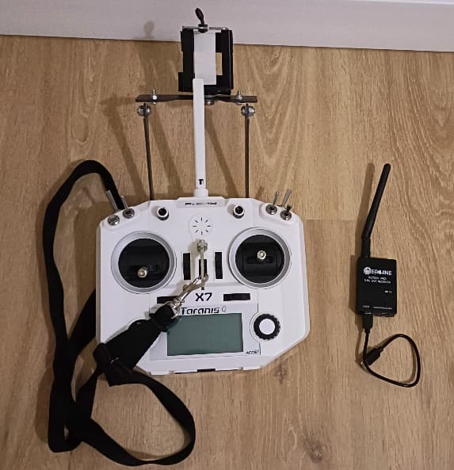
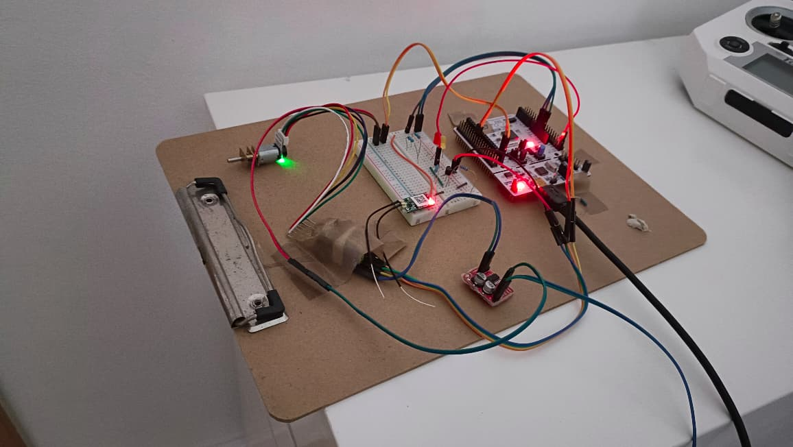
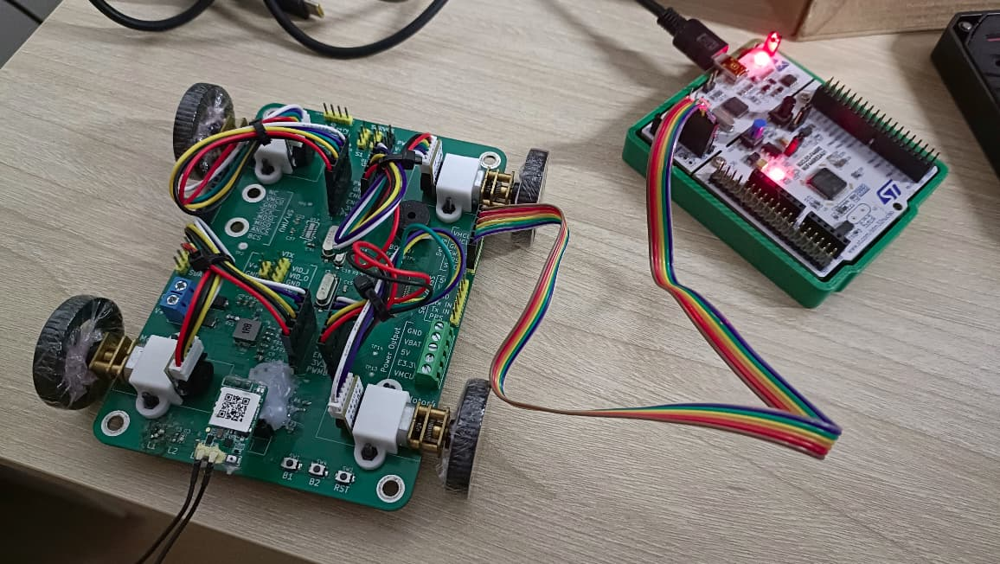

# Hardware

## RC Components



### Radio
I'm using my old [FrSky Taranis Q x7](https://www.frsky-rc.com/product/taranis-q-x7-2/) TX as the remote.

The receiver for the TX is done using the [XM+ FrSky receiver](https://betafpv.com/products/frsky-xm-sbus-mini-receiver) ([manual](https://www.frsky-rc.com/wp-content/uploads/2017/07/Manual/Manual-XM%2B.pdf)). This module uses an SBUS (Check [SBUS](../notes/sbus.md)) interface to connect to the MCU.

### Video Transmitter (VTX)

Again i'm using the VTX from my old tiny whoop. In my case i'm using the [TX06 from Eachine](https://www.eachine.com/Eachine-TX06-700TVL-FOV-130-Degree-5_8Ghz-40CH-Smart-Audio-Mini-FPV-Camera-AIO-Transmitter-For-RC-Dr-p-1418.html). This VTX has support for smart audio and OSD, which are not supported at the moment.

There are multiple compatible receivers. I'm using the [ROTG01 Pro](https://www.eachine.com/Eachine-ROTG01-Pro-UVC-OTG-5_8G-150CH-Full-Channel-FPV-Receiver-W-or-Audio-For-Android-Smartphone-Black-p-1246.html) receiver which connects to my phone to display and store the video feed. On the phone I'm using the FPViewer App.

## Motor Driver

Information about the motor driver and motor used can be seen in the [motor driver](../notes/motor_driver.md) page.

## MCU

### Nucleo
The initial development of the RC-Rover is done on an STM32 nucleo board:



* Board: Nucleo-F446RE
* MCU: STM32F446RET6

Important links:

* [Datasheet](https://www.st.com/resource/en/data_brief/nucleo-f446re.pdf)
* [Information page](https://www.st.com/en/evaluation-tools/nucleo-f446re.html)
* [Schematic](https://www.arrow.com/en/reference-designs/nucleo-f446re-stm32-nucleo-development-board-with-stm32f446ret6-mcu-supports-arduino-and-st-morpho-connectivity/f2ac4e6d8de8e6fba9c9553a41b0d756afdac90c8a34)

The different components (e.g. motor driver, SBUS, etc.) need to be connected following the definitions in
```firmware/target/nucleo/target.c```

#### Pin Out


[image source](https://www.thegioiic.com/upload/large/48757.jpg)

### BeepyRcBoard



* Check [main](../README.md) for information on the latest board releases, and board files.
* Check [design notes](../beepyRcBrd/rev_0_0/design_notes.md) for information on the board design decisions.

The board can be flashed and the debug traces received using the Nucleo board, after adjusting the jumper bridges on CN2, (see [tutorial](https://www.radioshuttle.de/en/turtle-en/nucleo-st-link-interface-en/)).

