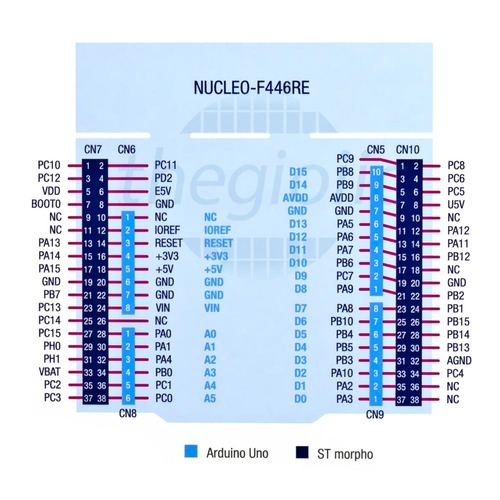

# Hardware

## Rx Receiver
The connection to the radio, which in my case is my old [FrSky Taranis Q x7](https://www.frsky-rc.com/product/taranis-q-x7-2/) radio, is done
Through the [XM+ FrSky receiver](https://www.frsky-rc.com/wp-content/uploads/2017/07/Manual/Manual-XM%2B.pdf)

## MCU
The development of the RC-Rover is done on a STM32 nucleo board:

* Board: Nucleo-F446RE
* MCU: STM32F446RET6

Important links:

* [Datasheet](https://www.st.com/resource/en/data_brief/nucleo-f446re.pdf)
* [Information page](https://www.st.com/en/evaluation-tools/nucleo-f446re.html)
* [Schematic](https://www.arrow.com/en/reference-designs/nucleo-f446re-stm32-nucleo-development-board-with-stm32f446ret6-mcu-supports-arduino-and-st-morpho-connectivity/f2ac4e6d8de8e6fba9c9553a41b0d756afdac90c8a34)

### Pin Out

[image source](https://www.thegioiic.com/upload/large/48757.jpg)
