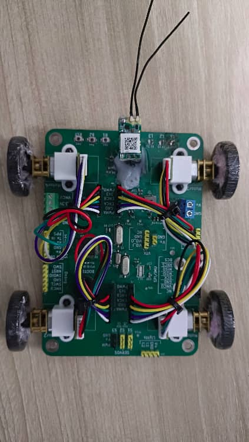
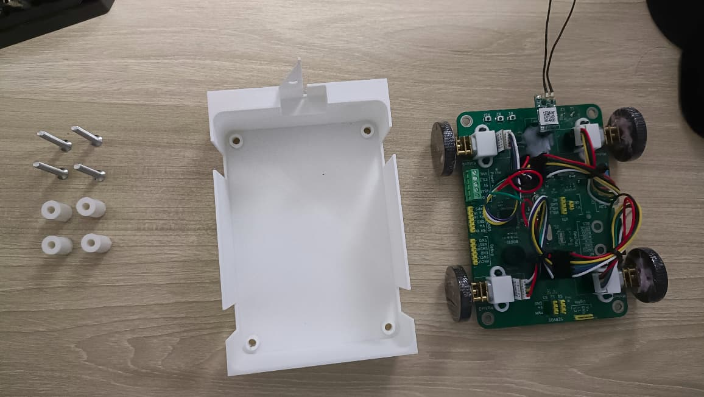
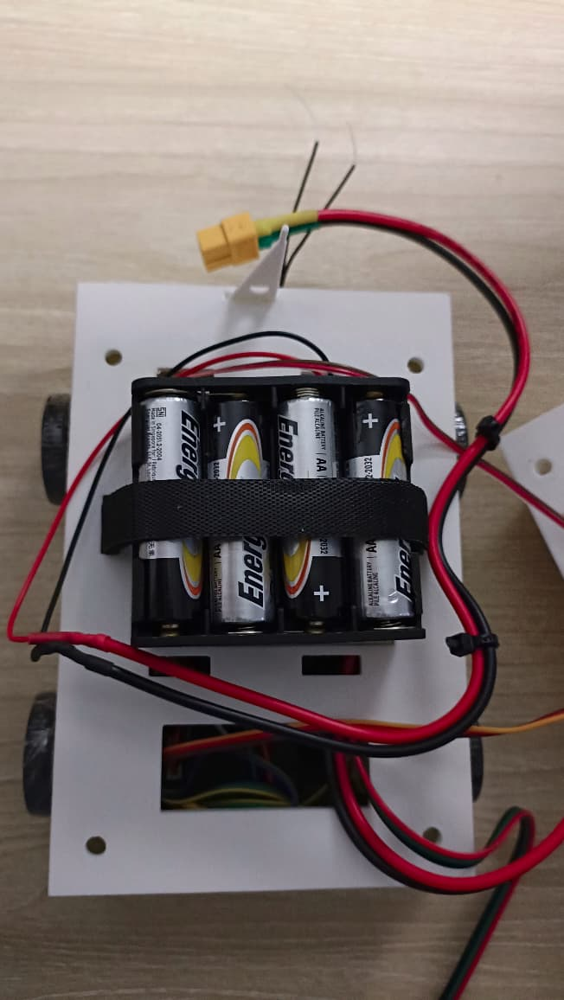
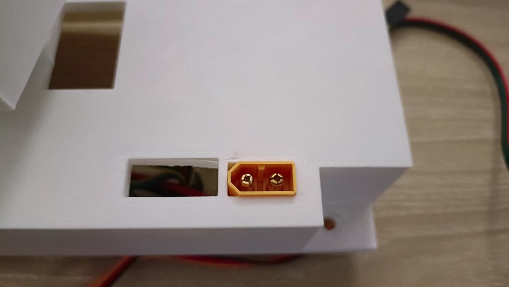
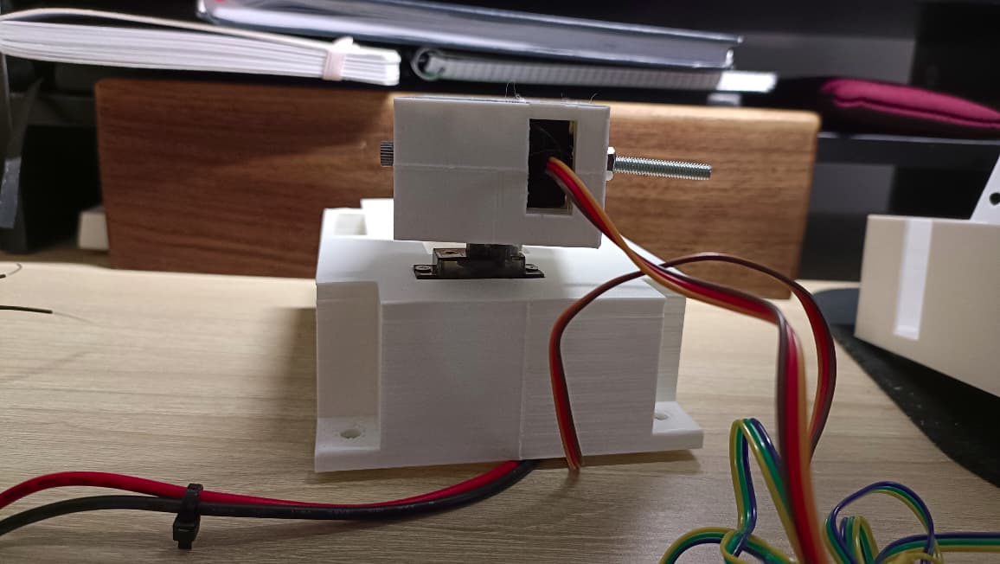
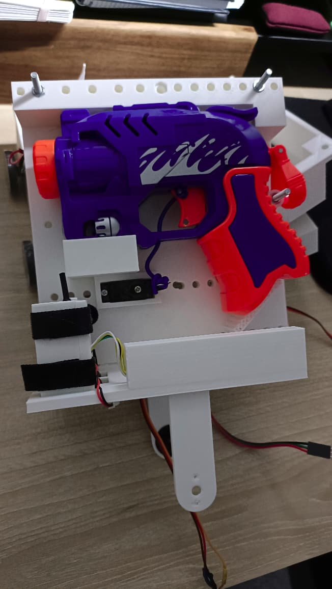
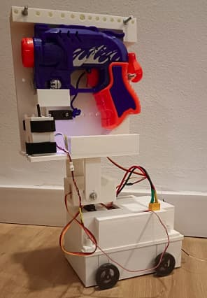

# Mechanical Release 1.0

## 3D Printable pieces

All 3D printable pieces have been made using Tinkercad, and are available to be remixed directly on their website. The following table links the different parts. The STLs of the parts is available on the repository for ease of use.

| Part | Description|
|---|---|
|[Bottom Enclosure](https://www.tinkercad.com/things/jpuFKT2e5q8-beepyrc-bottom-enclosure) | Bottom enclosure to hold the BeepyRcBrd |
|[Top Enclosure](https://www.tinkercad.com/things/cq1XpsLmDJL-beepyrc-top-enclosure) | Top enclosure that attaches to the bottom enclosure.|
|[Top Enclosure 2](https://www.tinkercad.com/things/cYBVxJHJOmw-beepyrc-top-enclosure-2) | Top part of the top enclosure goes on top of the Top Enclosure part. It houses the battery and pan servo. It uses the Tinkercad community SG90 servo model by Federico Dall'Orso (I was not able to locate the source to link, it can be referenced in the model itself).|
|[Enclosure Bolt Extender](https://www.tinkercad.com/things/6YzsgGTErdm-beepyrc-enclosure-bolt-extender) | M4 bolt extender to connect the top and bottom enclosures using a 30mm M4 bolt from the bottom and a 30mm M4 bolt from the top. It houses 3 M4 bolts. This part may be skip if you find 60mm M4 bolts.|
|[Top Enclosure bolt Extender](https://www.tinkercad.com/things/8HW3N3RYSTf-beepyrc-top-bolt-extender) | Spacer for the top enclosure bolt. It provides spacing between the Top Enclosure 2 and the top enclosure bolt, so it can be tightened correctly. |
|[BeepyRc Tilt Servo Holder](https://www.tinkercad.com/things/kKJ7Aj4eDxs-beepyrc-tilt-servo-holder) | Houses the MG996R servo that controls the tilt angle of the pan-tilt mechanism. It is glued directly to the horn of the pan angle servo. It uses the following [servo horn model](https://www.printables.com/model/1734482-servo-arms/files); and the Tinkercad community MG996R model by Randy Sarafan (I was not able to locate the source to link, it can be referenced in the model itself)|
|[Left Head Bracket](https://www.tinkercad.com/things/hJWzkLlVXu9-beepyrc-left-head-bracket) | Left bracket connecting the tilt servo to the head |
|[Right Head Bracket](https://www.tinkercad.com/things/isPPQw0B1cy-beepyrc-right-head-bracket) | Right bracket support that attached to tilt servo holder to serve as a second anchor point.|
|[BeepyRc Pan-Tilt Head Support](https://www.tinkercad.com/things/aVCM6FixHyH-beepyrc-pan-tilt-head-support) | Support of the pan-tilt mechanism that holds the VTX holder and the Nerf blaster holder.|
|[BeepyRc Back VTX Enclosure](https://www.tinkercad.com/things/5YyXrJhm8Ro-beepyrc-back-vtx-enclosure) | Back side of the the VTX Enclosure. It attaches tot he Pan-Tilt Head Support.|
|[BeepyRc VTX Front Enclosure](https://www.tinkercad.com/things/73pObGXGMkc-beepyrc-vtx-front-enclosure) | Front side of the the VTX Enclosure. It attaches tot he Pan-Tilt Head Support.|
|[BeepyRc Nerf Blaster Holder](https://www.tinkercad.com/things/jVXIg7vj2Tw-beepyrc-nerf-blaster-holder) | Nerf blaster holder, which attaches the nerf blaster and the shooting servo to the Pan-Tilt Head Support. It uses the Tinkercad community SG90 servo model by Federico Dall'Orso (I was not able to locate the source to link, it can be referenced in the model itself). |


## Non 3D printable Parts
| Part | Number | Description|
|---|---|---|
|30mm M4 Bolts | x8 | They can be replaced by x4 60mm bolts. They are used to connect the bottom and top enclosures.|
|50mm M4 Bolts | x4 | - |
| M4 Nuts | x16 | - |
|N20 motors with magnetic encoder | x4 | 6V 1500RPM motors ([example listing](https://es.aliexpress.com/item/1005004999529855.html?spm=a2g0o.order_list.order_list_main.132.3d49194dc47Stv&gatewayAdapt=glo2esp)). |
|N20 motor clip | x4 | With bolt and nut ([example listing](https://es.aliexpress.com/item/32814175769.html?spm=a2g0o.order_list.order_list_main.122.3d49194dc47Stv&gatewayAdapt=glo2esp)). |
|N20 motor wheels | x4 | [example listing](https://es.aliexpress.com/item/32809043739.html?spm=a2g0o.order_list.order_list_main.117.3d49194dc47Stv&gatewayAdapt=glo2esp)|
|SG90 servo| x2| One for the pan angle, and the other to shoot the Nerf blaster.|
|MG996R servo| x1 | For the Tilt angle. |
|BeepyRcBrd | x1 | Mounted. |
|Frsky XM + D16 SBUS | x1 | RC receiver ([example listing](https://es.aliexpress.com/item/32971177875.html?spm=a2g0o.order_list.order_list_main.127.3d49194dc47Stv&gatewayAdapt=glo2esp))|
|Battery holder | x1 | Any 6 to 12V battery pack will do the job. I'm using an old 12V AA battery holder |
| Nerf Blaster | x1 | I'm using the [following](https://www.aliexpress.com/item/1005010455817038.html?spm=a2g0o.order_list.order_list_main.15.3d49194dc47Stv) |

---

## Mounting summary

### Step 0 - Complete the PCA
Start by attaching, and wiring the ``N20 motors`` to the BeepyRcBrd PCA. Follow the wiring indication on the BeepyRcBrd silkscreen. The N20 motors come with the bare wires, so there is the option to solder the wires to the board, or crimp Dupont wires to perform the connections (this is the option I followed, but requires having the crimping tool). Complete the motor installation by connecting the wheels to the N20 motor shafts.

To improve steering, I covered the wheels in plastic wrap. This is needed due to the drift-based steering of 4wd vehicles. This is something to be improved in future releases.

continue by attaching the ``Frsky XM + D16 SBUS`` RC receiver (note that there is a rework to fix the wiring).

Finally, make sure the MCU is programmed, since it would not be possible to do so beyond this point without disassembling the rover.

At this point the BeepyRcBrd PCA should look as follows



### Step 1 - Bottom Enclosure

The BeepyRCBrd PCA is attached to the ``Bottom Enclosure`` using x4 30mm M4 bolts, and the cylindrical part of the ``Enclosure Bolt Extender``. Note that on the bottom part of the bolt extender there is a hole for an M4 bolt, that will hold the BeepyRcBrd.



### Step 2 - Top Enclosures

Before placing the ``Top Enclosure`` make sure to connect the servo, and battery wires to tbe BeepyRcBrd, passing the wire through the ``Top Enclosure`` cable hole.

Follow by placing the second piece of the ``Enclosure Bolt Extender`` needs to be screwed to the ``Bottom Enclosure`` bolts from the step before. This piece has holes for two M4 nuts, which need to be filled first. The bottom nut will be screwed to the ``Bottom Enclosure``'s bolts, while the top nut will be screwed later from the top.

Then, place the ``Top Enclosure`` on the ``Bottom Enclosure``. Note that there is a tab for the antenna holder that needs to be aligned.



### Step 3 - Pan Servo

Attach the pan ``SG90 servo`` to the servo mount on the ``Top Enclosure 2`` part. There are two screw holds that can be used to secure the servo.

Instead of a power on switch, I'm using a XT60 connector to connect/disconnect the power. There is a hole for this on the ``Top Enclosure 2``.



### Step 4 - Tilt Servo

First pass a 50mm M4 screw to that it is sticking out from the ``Tilt Servo Holder`` and use a M4 bolt to hold it in place.

Then, attach the tilt ``MG996R servo`` to the ``Tilt Servo Holder``. There are four screw holes for the servo screws to keep it in place. Do not attach any of the horns for now.



### Step 5 - Pan-Tilt Head Assembly

Attach the VTX on its enclosure using cable ties. Then, attach the assembly to the ``Pan-Tilt Head Support`` also using cable ties.

The Nerf blaster holder has a mounting hole for the shooting ``SG90 servo``, which can also be screwed to be kept in place.
The ```Nerf Blaster Holder`` is intended to keep the Nerf blaster in place without having to glue it in. The top and bottom holes on the holder are available to tie the blaster with strings if needed. It ended not being needed on my case.

Then, the shooting servo needs to be able to shoot the blaster. I modified to Nerf blaster's trigger to pass a wire that is connected ot the servo. Thus, when the servo rotates the trigger is actuated.

Finally, attach the ``Nerf Blaster Holder`` assembly to the ``Pan-Tilt Head Support``. There is a M4 screw hole to keep it in place. But it needs to be glued in place to prevent it from rotating.



### Step 6 - Head brackets

The ``Head Brackets`` are directly glued to the ``Pan-Tilt Head Support``. There are two tabs on the bottom part of the ``Pan-Tilt Head Support`` for each bracket. Check the image for the required orientation.

The ``Left Head Bracket`` has a hole for the circular horn that comes with the ``MG996R servo``. The horn needs to be glued to the bracket.


### Step 6 - Final Step

Finally, attach the ``Pan-Tilt Head Assembly`` to the main body. First pass the M4 bolt on the ``Tilt Servo Holder`` assembly through the M4 hole on the ``Right Head Bracket``. Use a nut to keep it in place. Then, Screw the circular horn glued to the ``Left Head Bracket`` to the tilt servo.

