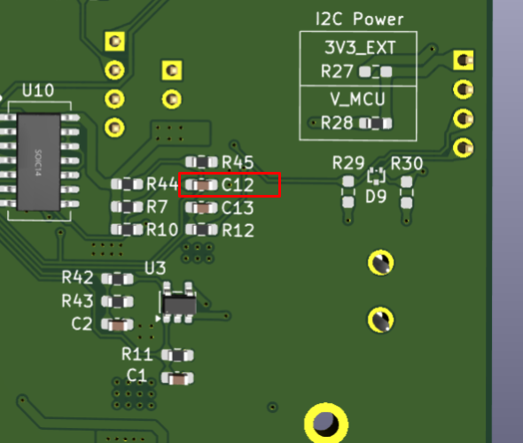
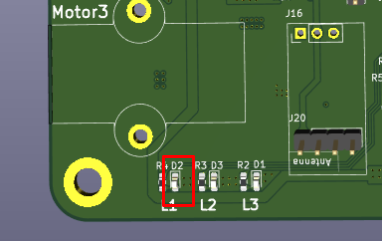
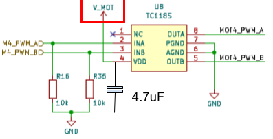

# Reworks for Rev 0.0

## 5V Enable Circuit Capacitor
The capacitor for the 5V enable circuit (C12) needs to be replaced by a _100uF_ capacitor. The 5V rail is enabled using an SR latch. The latch allows the MCU to disable the 5V rail keeping off until the battery is physically disconnected and reconnected after a few seconds. When the battery is first connected, the C12 capacitor keeps the NS input of the latch low long enough to set the latch. The timing needs to be increased for the circuit to work properly.

## Green LED
The green LEDs where not turning on due to their higher forward voltage rating compared to the other colors. This is fixed by replacing the green LED (D2) with a yellow LED (PN: C125100).

## RC Pins Reversed
The Pins for the RC module are reversed for J16. There are three options to fix this. I used the last one despite it requiring more work, it keeps the RC module more or less in the original orientation.

1. Place the module rotated with the antenna towards the center of the board.
2. Place the module with the bind button facing down.
3. Glue a different connector and use wires to swap the pins.

## Motor Drivers
There are two different fixes required for the motor drivers (TC118S). First, the maximum motor voltage rating for the ICs is 9V, which is lower than the accepted battery voltage. Lastly, the supply voltage needs a decoupling capacitor to operate as expected.

This rework is more complex than the rest, and require the following steps:

1. Before soldering the IC to the board, fold pin 4 (VDD) so that it does not touch the pad.
2. Solder the IC except for pin 4.
3. Short pin 7 (PGND) and pin 6 (AGND).
4. Solder a 4.7uF capacitor between the shorted pins 7 and 6 and pin 4.
5. Add a wire between pin 4 and V_Servo.

## Lights Enable
The lights enable signal is not connected to the MCU. For now no rework has been proposed for this, since there are no GPIOs available.